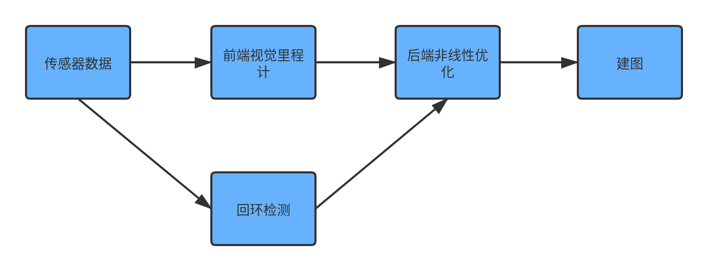
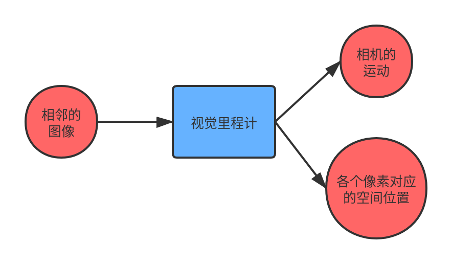

# 初识视觉SLAM

### 视觉SLAM做的事情
+ 我在什么地方？
+ 周围的环境是什么样的？

我在什么地方这个问题对应SLAM问题中的定位问题，周围的环境是什么样的对应SLAM问题中的建图问题。

### 视觉SLAM中不同的相机选择
+ 单目相机
+ 双目相机 (常用)
+ 深度相机

#### 1. 单目相机的优缺点

优点：成本低

缺点：无法通过单张图片计算场景中的物体与相机的距离，平移之后才能计算深度且该深度值是相对的，无法确定真实尺度。

#### 2. 双目相机的优缺点

优点： 可以计算出场景中的物体与相机的真实的距离

缺点：需要大量计算，相机的配置和标定比较复杂

#### 3. 深度相机的优缺点

优点： 通过物理的方法直接测量物体与相机之间的距离，不需要大量的计算

缺点：测量范围窄，噪声大，视野小，易受日光影响，无法测量透射材质。因此深度相机主要用于室内。

### 经典视觉SLAM框架

+ 传感器数据：读取双目相机的图像数据
+ 视觉里程计：估算相邻相机间的运动，以及局部地图的样子
+ 后端优化：接收不同时刻视觉里程计测量的相机位姿以及回环检测的信息，对它们进行优化，得到全局一致的轨迹和地图。
+ 回环检测：判断机器人之前是否到过该位置
+ 建图：建立与任务要求对应的地图。

#### 1. 视觉里程计

从上图中可以看出视觉里程计的作用主要是计算相邻图像之间相机的运动和图像中各个像素对应的空间位置

相机的运动叠加起来就构成了相机运动的轨迹

图像中各个像素点对应世界坐标系下的位置构成了地图

因此视觉里程计解决了我们之前提出的定位和建图的问题。

#### 2. 后端优化和回环检测

尽管视觉里程计完成了视觉SLAM的所要解决的问题，但是视觉里程计只是对相邻两个图像进行估计，这种估计是存在误差的，因此我们需要通过后端优化和回环检测来消除这种误差。

### SLAM问题的数学表述

表示k时刻相机的位置，使用数学表述为

 表示上一个时刻相机的位置， 表示当前时刻运动传感器获取到的数据，表示当前时刻的噪声。

表示相机的时刻k从第j个路标点获取到的观测数据，使用数学表述为

表示第i个路标， 表示k时刻相机的位置，表示此次观测的噪声。

因此slam问题用数学表述为

